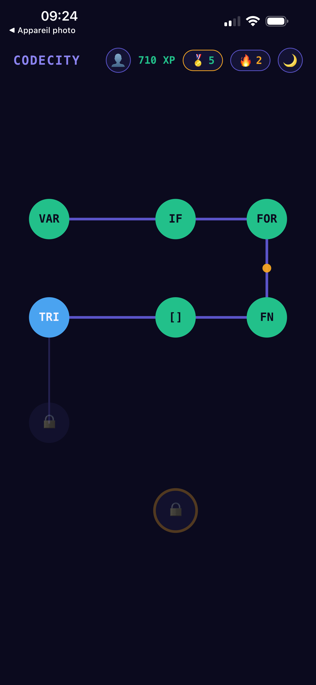
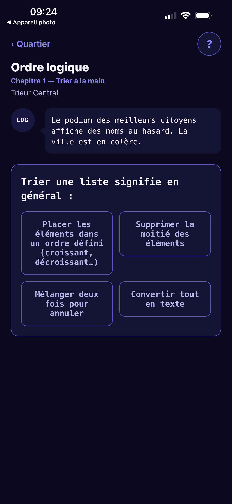
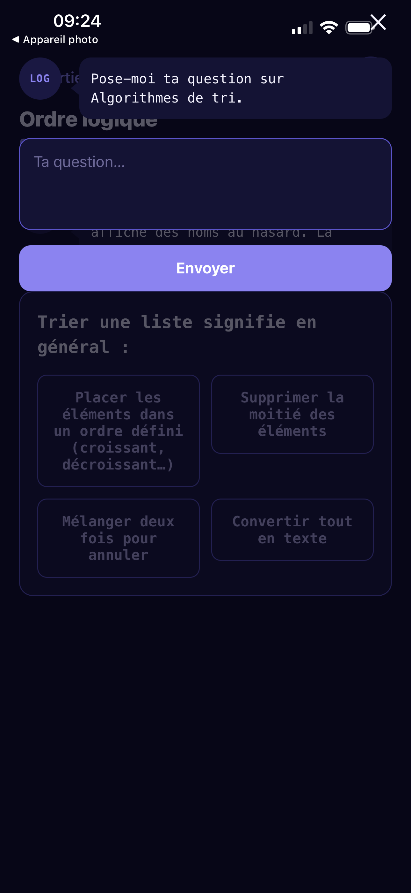
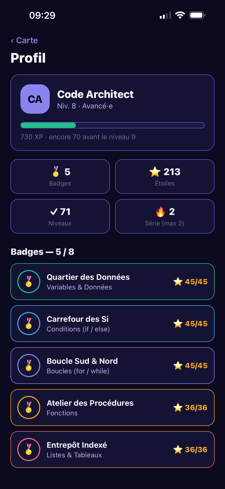

# CodeCity 🏙️

> *« La ville de CodeCity est entièrement gouvernée par des algorithmes. Un bug mystérieux se propage. LOG, l'IA gardienne, t'a recruté comme Code Architect. À toi de sauver la ville. »*

**Projet fil rouge — Développement d'application front / back (M2 Dev Fullstack, Ynov Connect).**
Auteur : **ZAKARIA Anouar** · Dépôt : https://github.com/zak201/CodeCity

[](https://expo.dev/)
[](https://reactnative.dev/)
[](https://www.typescriptlang.org/)
[](https://expressjs.com/)
[](https://www.prisma.io/)
[](https://jwt.io/)
[](https://nodejs.org/)

CodeCity est le jeu que j'ai construit pour ce module : un **jeu mobile éducatif** qui apprend les bases de l'algorithmique à des débutants complets, sans jargon et sans cours magistral. On y répare une ville « quartier par quartier », chaque quartier enseignant un concept (variables, conditions, boucles…), à travers des puzzles courts de 5 à 15 minutes.

Mon objectif était d'aller au bout d'une vraie chaîne **front ↔ back** : une app React Native / Expo, une API REST **sécurisée par JWT**, une base gérée avec Prisma, et une **fonctionnalité IA réellement branchée** (le tuteur LOG, propulsé par l'API Claude).

---

## 📸 Aperçu



<p>
  
  
  
</p>

*(Autres captures dans [`docs/mockups/`](docs/mockups/) : carte en mode jour, vue d'un quartier, panneau de sélection.)*

---

## 🚀 Démarrage rapide (voir le jeu en 2 min)

Le jeu est **jouable seul, sans backend ni compte** (progression stockée en local). Le plus rapide :

```bash
git clone https://github.com/zak201/CodeCity.git
cd CodeCity
npm install
npx expo start
```

Dans le terminal Expo :

| Touche | Ouvre l'app dans… | Prérequis |
|---|---|---|
| **`w`** | le **navigateur** | rien (le plus rapide) |
| QR code | **Expo Go** sur ton téléphone | app Expo Go + même Wi-Fi |
| **`i`** / **`a`** | simulateur iOS / émulateur Android | Xcode / Android Studio |

> J'ai fait le choix de l'**offline-first** : sans backend, tout tourne (progression locale via AsyncStorage) et LOG répond via une base de connaissances embarquée. Le backend + l'IA temps réel sont un **bonus** décrit plus bas.

---

## 🧩 Installation complète

### Prérequis
- **Node.js 20 LTS** ou plus, et **npm** (vérifier : `node -v`)
- **Git**
- Pour tester sur mobile : l'app **Expo Go**. Sinon le mode **web** (`w`) suffit.
- *(Optionnel — IA LOG)* une **clé API Anthropic** — https://console.anthropic.com

### 1) Front-end — l'app (obligatoire)

```bash
npm install
npx expo start   # puis w (web), QR code (Expo Go) ou i/a (émulateurs)
```

### 2) Back-end — API REST (pour l'auth, la synchro et l'IA)

```bash
cd server
npm install
cp .env.example .env             # PORT, DATABASE_URL, JWT_SECRET, clé IA…
npx prisma migrate dev           # crée la base SQLite + applique les migrations
npx prisma db seed               # données + comptes de démo
npm run dev                      # API sur http://localhost:3050
```

Vérifier que l'API répond : **http://localhost:3050/api/health** → `{"status":"ok"}`.

### 3) Comptes de démonstration

Le seed crée deux comptes (mot de passe **`codecity123`**) :

| Email | Rôle | Ce qu'il permet |
|---|---|---|
| `admin@codecity.dev` | **admin** | lister les utilisateurs (`GET /api/users`) |
| `player@codecity.dev` | user | connexion + synchro de la progression |

### 4) IA LOG — Claude (optionnel)

Sans clé, LOG répond déjà (base locale). Pour activer les **vraies réponses de Claude** : ajouter `ANTHROPIC_API_KEY=sk-ant-...` dans `server/.env`, relancer `npm run dev`, puis dans l'app ouvrir un niveau → bouton **?** → poser une question. La clé reste **strictement côté serveur**.

### 5) Depuis un téléphone physique

L'app cible `http://localhost:3050/api` (`app.json` → `expo.extra.apiUrl`). En **web** ou **simulateur iOS**, `localhost` marche. Sur un **téléphone** (Expo Go) ou un **émulateur Android**, remplacer par l'**IP LAN** de la machine :

```json
"extra": { "apiUrl": "http://192.168.1.20:3050/api" }
```

---

## 🤖 La fonctionnalité IA — LOG, le tuteur

LOG est l'IA tutrice du jeu. Quand un joueur bloque, il peut lui poser une question sur le concept du niveau ; elle répond par une explication **courte, avec une analogie**, sans jamais donner la réponse de l'exercice.

- **Modèle** : API **Claude** (`claude-haiku-4-5` par défaut, configurable via `LOG_MODEL`) — rapide et économique pour de courtes réponses.
- **Où** : l'appel se fait **uniquement côté backend** — `askLog()` (`lib/claude.ts`) → `POST /api/log/ask` → Claude. La clé n'est jamais dans l'app.
- **Dans le contexte du jeu** : j'envoie à LOG le quartier, le chapitre et l'énoncé du niveau, pour des réponses ancrées dans l'univers (pas génériques).
- **Offline-first** : si le serveur est injoignable ou sans clé, l'app retombe sur une base de connaissances locale.

> Pour la démonstration, je lance le serveur **avec** la clé pour que ce soit un vrai appel Claude (le repli local n'est là que comme filet de sécurité).

---

## 🔐 Authentification (JWT)

L'auth est **optionnelle** : on peut jouer sans compte. Se connecter sert à **sauvegarder sa progression** et à la retrouver sur un autre appareil.

- Inscription / connexion → mot de passe haché avec **bcrypt**, jeton **JWT** (HS256) renvoyé au client.
- Middlewares `requireAuth` (vérification du token) et `requireRole` (**gestion des rôles** `user` / `admin`) — `server/src/auth.ts`.
- Les routes `/api/me/*` dérivent l'utilisateur **du token**, jamais d'un id fourni par le client.
- `GET /api/users` est réservé au rôle **admin**.

Côté app : un écran connexion/inscription (`app/(game)/auth.tsx`), le token stocké dans `authStore`, et le bouton connexion/déconnexion depuis le Profil.

---

## 🛠️ Stack technique & mes choix

| Couche | Choix | Pourquoi (mon raisonnement) |
|---|---|---|
| Mobile | React Native + **Expo (SDK 54)** | Une seule codebase iOS / Android **et web**, test instantané sur téléphone. |
| Langage | **TypeScript** strict | Types partagés front/back, refactor sans stress, zéro `any`. |
| Navigation | **Expo Router** | Routage par fichiers, lisible, deep-linking natif. |
| État | **Zustand** + persistance AsyncStorage | Léger, sans le boilerplate de Redux ; c'est ce qui rend l'offline-first quasi gratuit. |
| Backend | **Express + Prisma** | Minimal, même langage que le front, migrations versionnées. |
| Auth | **JWT** (bcrypt + jsonwebtoken) | Standard, stateless, rôles simples à gérer. |
| Base | **SQLite** (dev) → PostgreSQL (prod) | Zéro config en dev ; bascule via une seule variable Prisma. |
| IA | **Claude API** via proxy backend | Qualité pédagogique + clé protégée côté serveur. |

---

## 🗄️ Modèle de données

```prisma
model User {
  id             String         @id @default(cuid())
  username       String         @unique
  email          String?        @unique
  passwordHash   String?
  role           String         @default("user")
  xp             Int            @default(0)
  level          Int            @default(1)
  placementLevel String?
  createdAt      DateTime       @default(now())
  progresses     UserProgress[]
  streak         Streak?
}

model UserProgress {
  id          String   @id @default(cuid())
  userId      String
  districtId  String
  levelId     String
  stars       Int
  completedAt DateTime @default(now())
  user        User     @relation(fields: [userId], references: [id], onDelete: Cascade)
  @@unique([userId, levelId])
}

model Streak {
  id             String    @id @default(cuid())
  userId         String    @unique
  currentStreak  Int       @default(0)
  longestStreak  Int       @default(0)
  lastPlayedDate DateTime?
  user           User      @relation(fields: [userId], references: [id], onDelete: Cascade)
}
```

Le **contenu du jeu** (quartiers, niveaux, questions) n'est pas en base : je l'ai versionné dans `data/` (fichiers TypeScript). La base ne stocke que l'état dynamique par joueur — un choix qui garde la base minimale et le contenu modifiable par simple commit.

---

## 🌐 API REST

Base URL : `http://localhost:3050/api`

```
GET    /health                        sonde de disponibilité

POST   /auth/register                 { email, username, password } → { token, user }
POST   /auth/login                    { email, password }           → { token, user }
GET    /auth/me                       profil du user connecté (Bearer token)

PATCH  /me                            { xp?, level?, placementLevel? }        (token)
GET    /me/progress                   niveaux complétés                       (token)
POST   /me/progress                   upsert { districtId, levelId, stars }   (token)
PUT    /me/streak                     { currentStreak, longestStreak, ... }   (token)

GET    /users                         liste des utilisateurs                  (admin)
GET    /users/:id                     un utilisateur + relations              (admin)

POST   /log/ask                       { concept, question } → { answer }      (IA LOG)
```

Codes d'erreur : `400` (validation), `401` (token absent/invalide), `403` (rôle insuffisant), `404`, `409` (email/username pris), `500`.
Un fichier `server/test.http` (extension **REST Client**) permet de tester toutes les routes.

---

## 🏙️ La ville — 8 quartiers, 94 niveaux

| # | Quartier | Concept | Niveaux |
|---|---|---|---|
| Q1 | Quartier des Données | Variables & données | 15 |
| Q2 | Carrefour des Si | Conditions (if / else) | 15 |
| Q3 | Boucle Sud & Nord | Boucles (for / while) | 15 |
| Q4 | Atelier des Procédures | Fonctions | 12 |
| Q5 | Entrepôt Indexé | Listes & tableaux | 12 |
| Q6 | Trieur Central | Algorithmes de tri | 10 |
| Q7 | Spirale Miroir | Récursivité | 10 |
| BOSS | Tour Centrale | Défi final (mécaniques mixtes) | 5 |

Quatre mécaniques de jeu : **QCM narratif**, **prédiction de sortie**, **remise en ordre** de lignes, **glisser-déposer** (compléter le code). Au premier lancement, un test de placement de 8 questions détermine le quartier de départ.

---

## 📋 Où trouver chaque livrable (barème du module)

| Activité | Livrable | Où le trouver |
|---|---|---|
| 1 | Architecture globale + doc technique | [`ARCHITECTURE.md`](ARCHITECTURE.md), [`docs/document-de-cadrage.html`](docs/document-de-cadrage.html) |
| 2 | MCD & MLD | [`docs/document-de-cadrage.html`](docs/document-de-cadrage.html) (§2), `server/prisma/schema.prisma` |
| 3 | Routes API REST | `server/src/routes/`, section **API REST** ci-dessus |
| 4 | Document de cadrage + wireframes | [`docs/document-de-cadrage.html`](docs/document-de-cadrage.html), [`docs/mockups/`](docs/mockups/) |
| 5 | Sécurisation JWT | `server/src/auth.ts`, `server/src/routes/auth.ts`, section **Authentification** |
| 6 | Frontend + flux de données | `app/`, `lib/`, `store/` |
| 7–8 | Implémentation & optimisation | tout le dépôt, [`SPRINT.md`](SPRINT.md) (sprint de stabilisation) |
| 9 | Finalisation + analyse critique | ce README (ci-dessous) + [`SPRINT.md`](SPRINT.md) |
| — | Fonctionnalité IA | `lib/claude.ts`, `server/src/anthropic.ts`, `server/src/routes/log.ts` |

**Documents du projet :** [Document de cadrage](docs/document-de-cadrage.html) · [Présentation / slides](docs/presentation.html) · [Architecture technique](ARCHITECTURE.md) · [Rapport de sprint](SPRINT.md).

---

## 🔎 Analyse critique — limites & pistes

Ce que je retiens et ce que je ferais avec plus de temps :

**Limites assumées**
- L'app est **pensée mobile** ; elle tourne sur le web via Expo web (`npm run web`), ce qui satisfait l'exécution navigateur, mais l'ergonomie reste optimisée pour le tactile.
- L'IA nécessite une **clé Anthropic** ; sans clé, le repli local est une base de règles (utile mais pas génératif).
- Pas de **déploiement** (exécution locale, comme le permet le sujet) ni de **tests automatisés / CI** (hors périmètre).
- Le **barème d'étoiles** est encore perfectible (le palier 1 étoile est rarement atteint) et le contenu est surtout rodé sur les premiers quartiers.

**Pistes d'amélioration**
- Notifications push pour la série quotidienne, migration vers **PostgreSQL/Supabase**, **refresh token** pour l'auth, tests end-to-end, et un mode « défi entre amis ».

**Ce que ce projet m'a appris**
- Concevoir une **architecture client-serveur découplée** et **offline-first**, mettre en place une **auth JWT** propre (hash, vérification, rôles), et **intégrer une IA** sans jamais exposer la clé côté client. La partie la plus formatrice a été de garder l'app pleinement jouable hors-ligne tout en branchant une vraie synchro et une IA temps réel.

---

## 📁 Structure du projet

```
CodeCity/
├── app/                 # Écrans Expo Router (welcome, map, placement, auth, district, profile)
├── components/          # UI : mécaniques de jeu (QCM, Prediction, OrderLines, FillBlanks) + LOG
├── store/               # Zustand : user, progress, streak, auth (persistés)
├── lib/                 # claude (IA), api, auth, sync, placementRewards
├── data/                # Contenu du jeu (districts, niveaux, test de placement)
├── docs/                # Cadrage, présentation, wireframes (captures)
└── server/              # API Express + Prisma (auth JWT, /me, /users, /log)
```

---

## Licence

MIT — voir [`LICENSE`](LICENSE).
